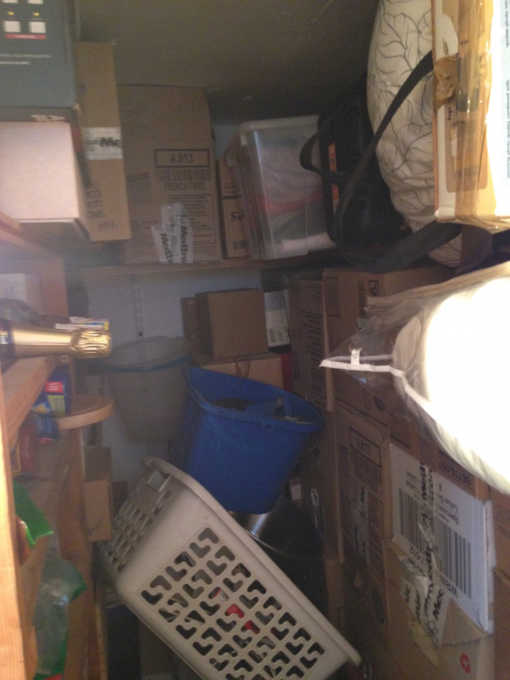
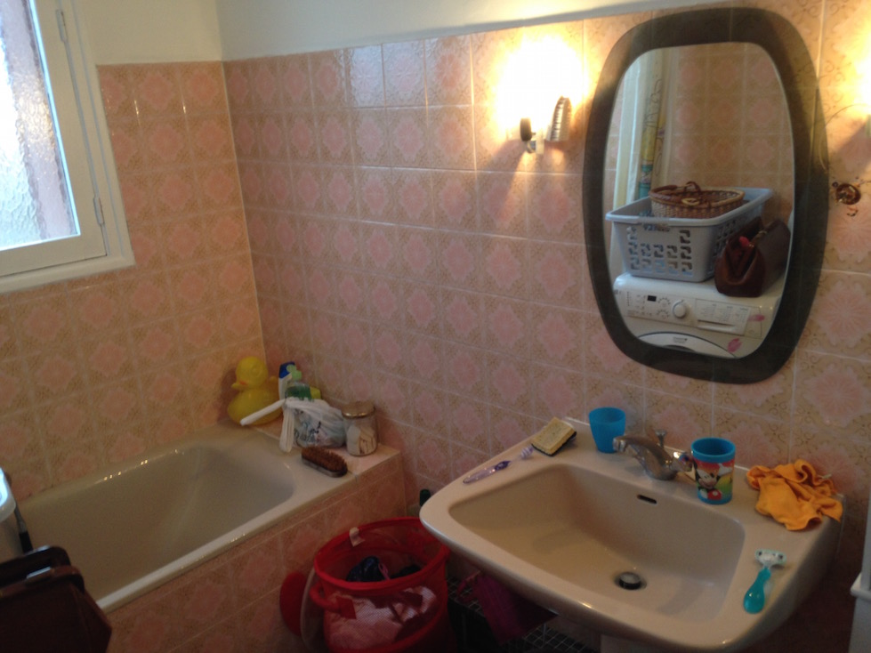



# Description

Il y a 3 types d'appartement dans l'immeuble:
- Des T3, de ... m2 de superficie.
- Des T4, de ... m2 de superficie.
- Des T5, de ... m2 de superficie.

Ces appartements sont accompagnés d'un cellier, qui est soit à part, soit intégré dans l'appartement.

Celui-ci, le 46, est situé au 4ème étage, avec vue sur le canal. Le cellier est intégré à l'appartement.

C'est un T4, dont une cloison a été abattue afin de proposer un plus grand salon.

# Tour du propriétaire

L'appartement est actuellement habité par 6 personnes (temporairement, en attendant la fin des travaux réalisés dans l'appartement 78, qui a la même configuration que celui-ci).

Aucun chantier de travaux n'a été réalisé. La cuisine est quasiment neuve.

## Première chambre

## Deuxième chambre

## Couloir

## Cellier

## Salle de bains

## Cuisine

# Achat

