

# 20/02/2016 - Le départ

Yun me dépose à l'aéroport de Blagnac en fin d'après-midi. C'est avec un pincement au coeur que j'arrive à l'embarquement.

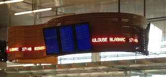

Dans l'avion, enfin. Le soleil se couche bientôt, les couleurs sont magnifiques, malheureusement, j'ai peu de "sujets" à photographier. :)

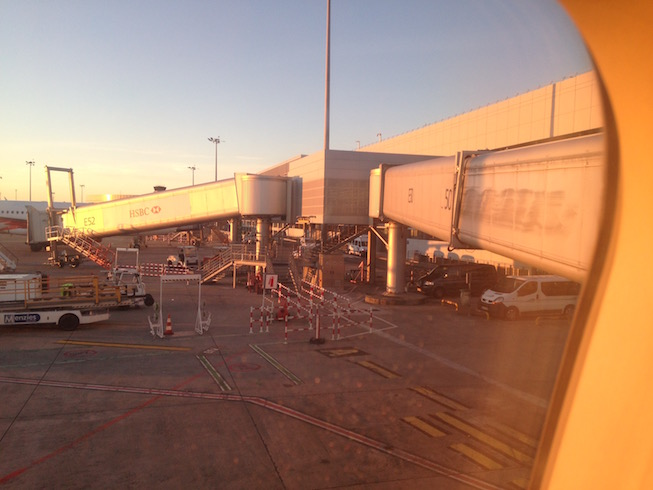

Un petit "selfie" qui va servir de "health-check". On verra quelle apparence j'aurai après le vol jusqu'à San Francisco.

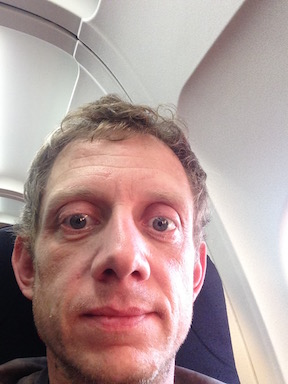

Les conditions d'éclairage (et l'appareil photo de l'iPhone) ne sont pas idéales pour retranscrire la beauté simple de cette image, ce "deuxième coucher de soleil" dans un lit de nuages.

Retour sur terre et arrivée à CDG, avec son archtecture si... spéciale.

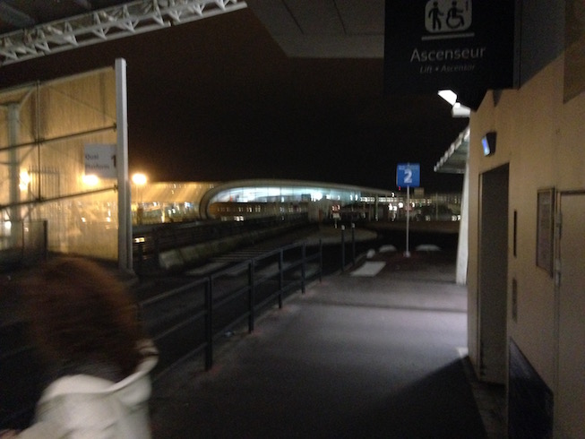

Arrivée via une navette à l'hôtel. La chambre est plutôt spacieuse.

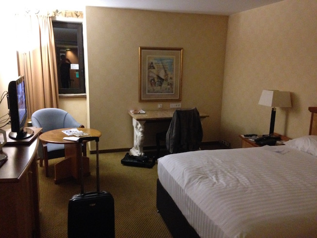

Le restaurant, sous forme de pub irlandais.

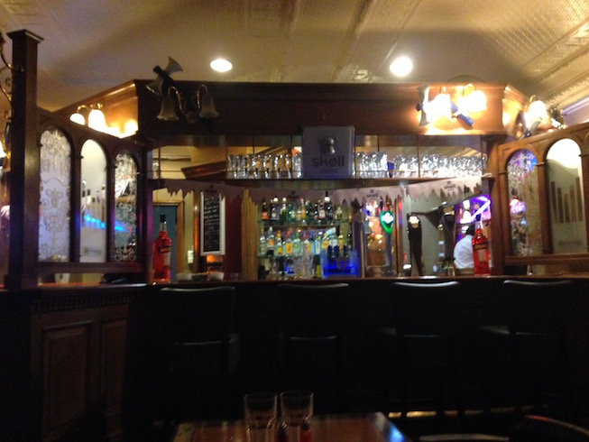

Et mon repas de ce soir. La journée va être longue demain, c'est le moment de prendre des forces. :)

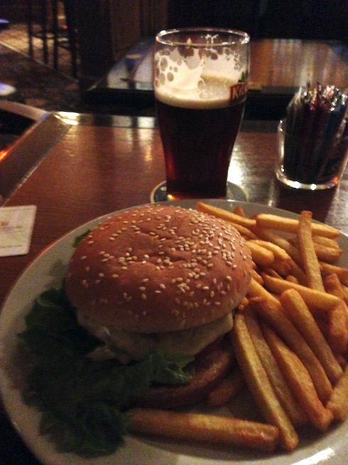

# 21/02/2016 - Arrivée à San Francisco

L'embarquement à CDG le matin. Malgré un peu de retard, cela s'est déroulé relativement rapidement. Me voici dons dans l'avion.

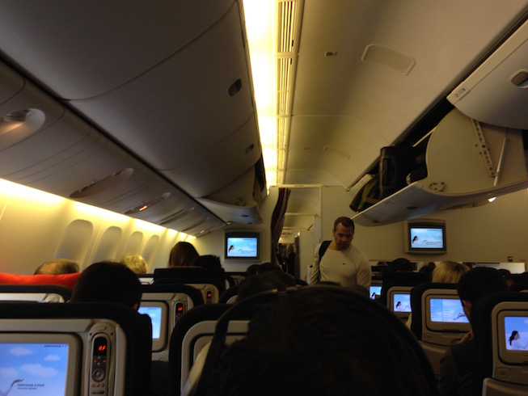

Après 11h30 de vol, et les formalités d'immigration et douanières (pas de photo de celles-ci, vous vous doutez bien), je retrouve mon collègue Cyril, et nous partons en taxi à l'hôtel.

L'occasion de prendre enfin quelques photos de San Francisco.

En quittant l'aéroport...

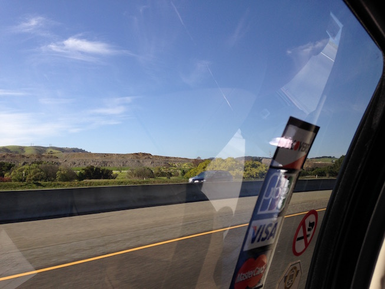

Arrivée en ville, avec les premiers "skyscrapers".

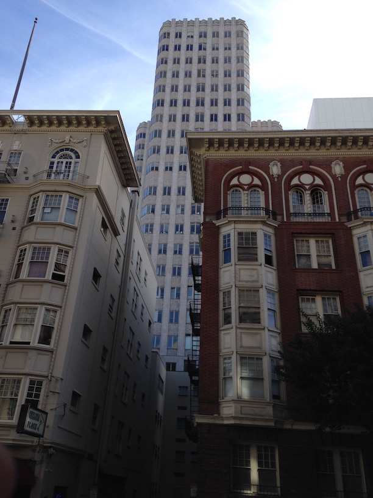

Petit tour à l'hôtel histoire de poser nos affaires, il est moins de 15h ici, pas question de s'enfermer. :)

Une photo de la chambre, en passant. Pas mal.

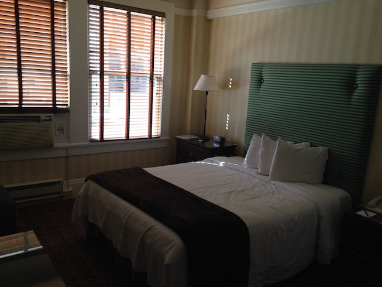

Nous voici dehors, quelques photos des alentours.

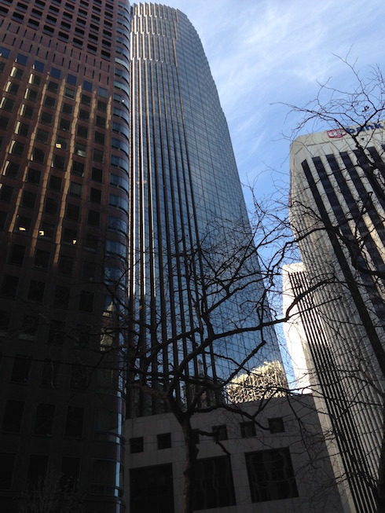

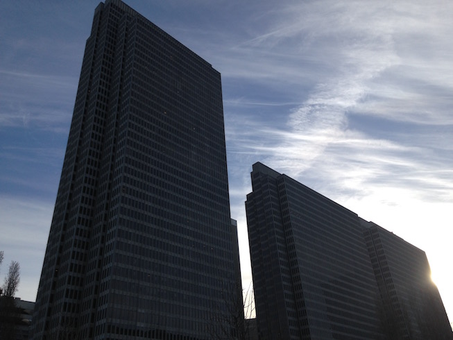

Depuis les quais.

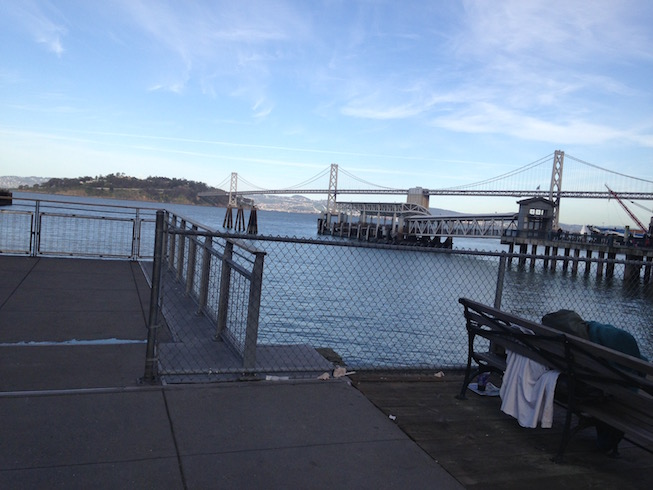

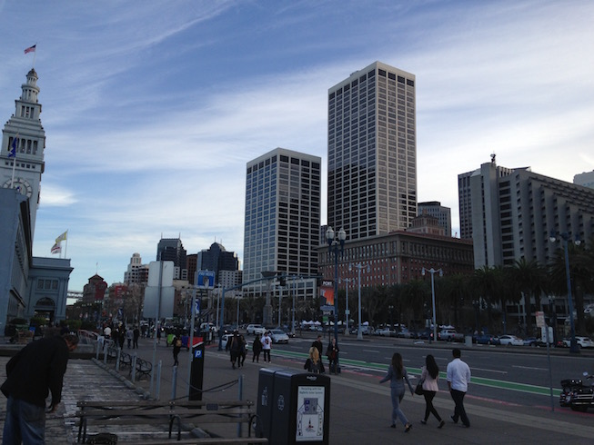

Des publicités pour Braintree. C'est assez étonnant de voir des sujets aussi confidentiels et spécialisés que le paiement électronique, affichés sous forme publicitaire en pleine rue...

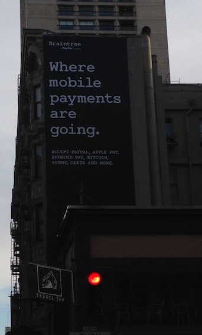

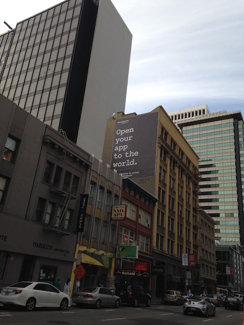

En rentrant vers l'hôtel, Cyril et moi nous rendons compte que nous sommes proches du "Chinatown" local. Ici, tout flirte avec le bon goût sans jamais tomber dedans. :)

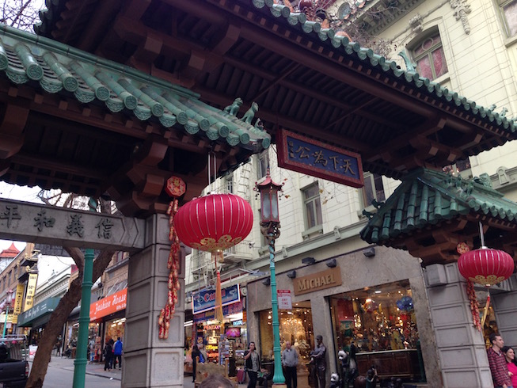

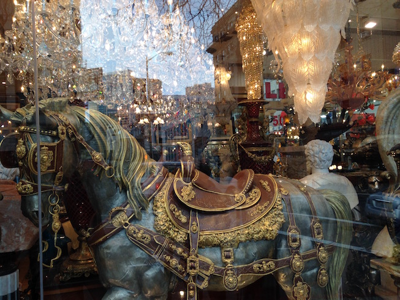

Dans la soirée, nous retrouvons quelques participants pour une repas dans un restaurant péruvien. Mais, épuisés par le voyage, nous faisons symboliquement acte de présence le temps de quelques "tapas", et rentrons dormir.

# 22/02/2016 - Premier jour, meeting "Interest Group"

On attaque avec un solide petit déjeuner, la nuit a été courte à cause du jetlag, et la journée s'annonce longue...

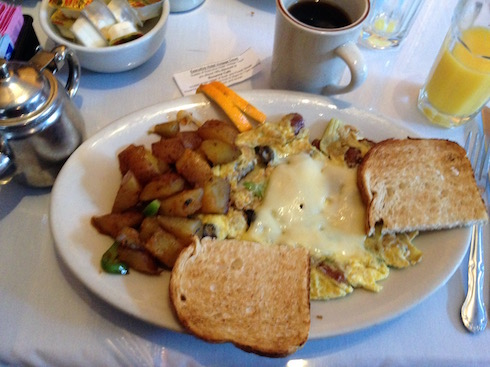

J'en profite pour faire quelque photos de l'hôtel et ses alentours.

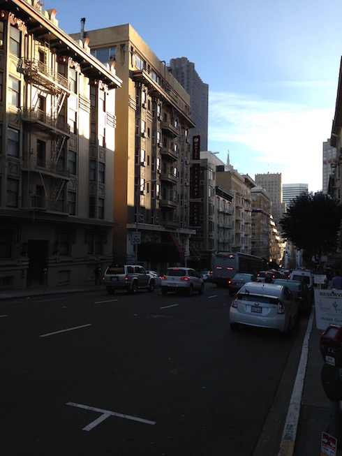

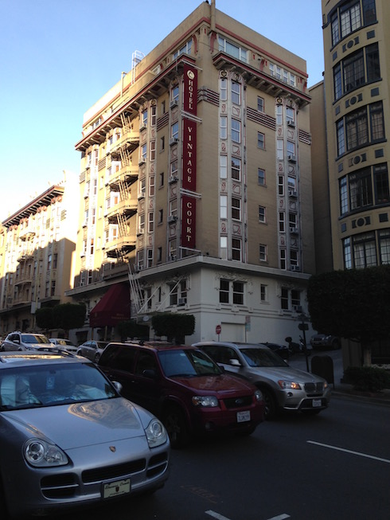

Une demi-heure de marche plus tard, nous arrivons sur le lieu du meeting, à savoir chez Google. Ce n'est hélas pas le siège social (Mountain View) qui se situe asez loin, mais quelques étages dans une tour en plein centre.

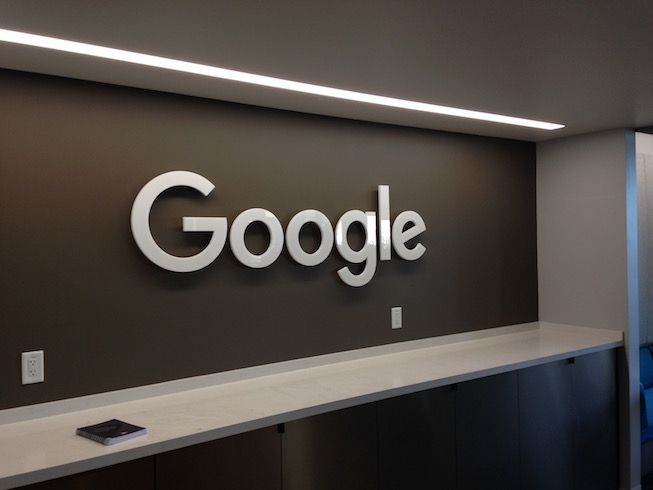

Je récupère mon badge, et me voici officiellement un "Google Guest" :)

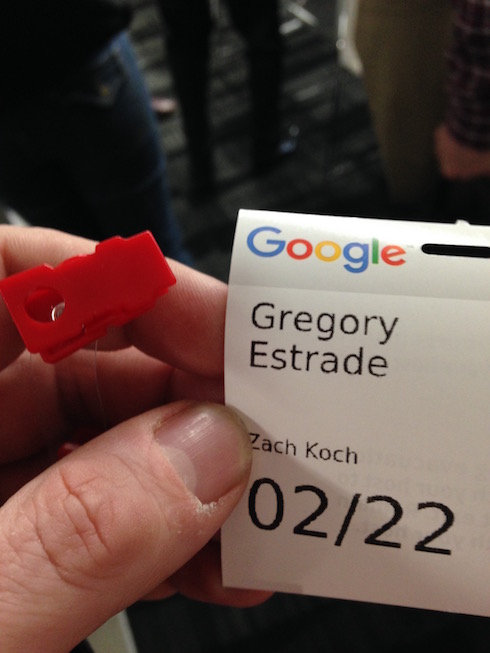

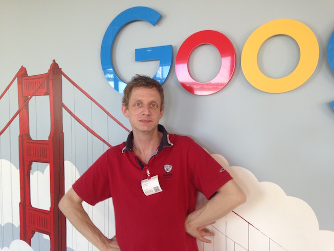

Direction la salle de meeting, où environ 35 personnes sont conviées. Les thèmes abordés sont extrèmement divers et variés. Tout est calibré à la minute près. C'est très "carré", mais j'ai l'impression d'un "survol" des thèmes, bref, qu'il manque de pilotes dans les différents avions... Certains parmi eux ont plutôt des airs de paquebots, qui vont droit vers un iceberg, mais dont il est déjà trop tard pour effectuer la manoeuvre d'évitement (exemple: harmonisation ISO 20022, traitée par des non-spécialistes, bon courage).

Pause déjeuner, des "club sandwiches" offerts généreusement, je ne regrette pas mon petit-déjeuner gargantuesque du matin, du coup. La vue depuis la terrasse vaut son pesant d'or, ceci dit.

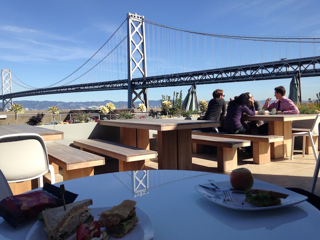

Les thématiques s'enchaînent, cela donne le tournis. La journée s'achève par un dîner planifié à... 18:30. Restaurant thaïlandais, d'une superficie impressionnante, mais j'ai l'impression que la notion de "petit restaurant" n'a pas cours ici.

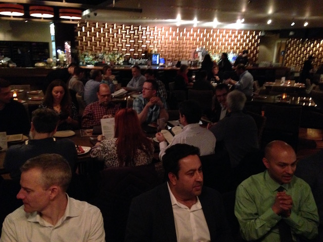

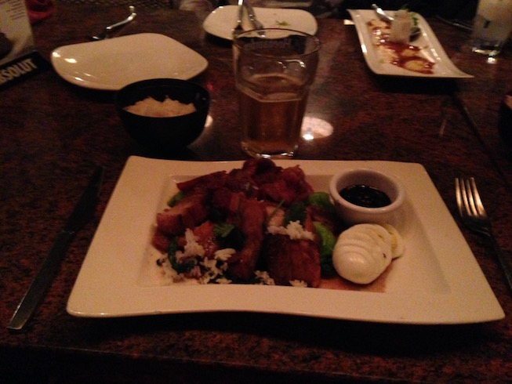

Vers 21h, tout le monde regagne ses pénates. Ca tombe bien, Cyril et moi n'avons pas encore digéré le jetlag, et visiblement nous ne sommes pas les seuls. Petite pensée pour ceux arrivés parfois de loin le matin, et qui repartent le soir même. Il faut en vouloir...

# 23/02/2016 - Deuxième jour, meeting "Working Group - Day 1"

La différence entre les IG et les WG est que les premiers ne sont pas directement pilotés par le W3C, ils servent principalement de "sources d'inspiration" (d'où la variété des thèmes abordés) aux WG.

Dans les WG, on est plus proche de la réalité. Ici, on parle spécifications, use cases, API. Enfin, dans le vif du sujet.

L'audience est plus nombreuse que celle de l'IG, ce qui selon Cyril est plutôt inhabituel (en général, donner des conseils et lancer des idées rassemble plus de personnes que rédiger des spécifications et réaliser des POCs).

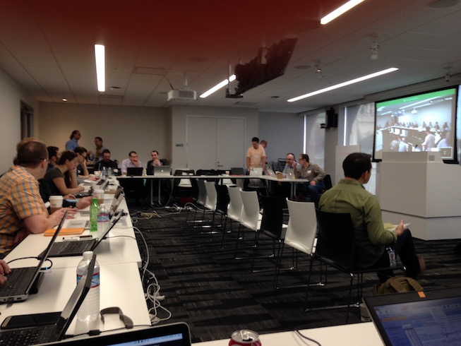
