

# Etat des lieux

## L'appartement

On est dans du "chantier pas fini permanent", un peu comme l'appart de René :-) mais en bien pire.

Illustration:

Là c'est le salon, la chambre de Nicolas c'est le même esprit, y'a que la chambre de Yun qui fait plus "finie".

Après il y a la salle de bains, qui est finie, mais moche. Années 60-70, souvenez-vous (ou imaginez), on flirte avec le bon goût sans jamais tomber dedans.

## I had a dream

C'est là que tout est permis, on se lâche, et hop on arrive à ça:

Ca c'est rien, encore, allez hop, la troisième dimension:

### Chambre de Nicolas

Voilà la chambre de rêve du djeunz:

Sur le côté droit, on mettra surement un bureau.

# Electricité - Etat des lieux

## La source

Situé au-dessus de la porte d'entrée, le disjoncteur qui fleure bon le vintage. A sa gauche le différentiel général (enfin je crois) qui a l'air d'arriver sur un... "trilili", sobrement intitulé "répartition phase".

**TODO? Remplacer ce truc?**

La plupart de la filasse sortant de ce répartiteur part dans des tuyaux old-school qui constituent l'installation d'origine.

L'un des gros fils rouges part dans une gaine qui alimente un tableau standard.

**TODO? Tableau plus petit? Ou le compléter et y faire tout descendre?**

C'est la gaine complètement à droite, qui descend dans le tableau. Le reste des gaines remonte dans un faux plafond. Le concepteur de l'installation suivante devait être atteint de plaquystérie aïgue. Aïe.

Le tableau en question:

## L'installation d'origine

A l'origine, ça couvrait toutes les pièces (thank you, captain obvious).

Maintenant, ça couvre la cuisine, la salle de bains, la chambre de Yun.

**TODO? Remplacer à minima les prises, interrupteurs, parce que là ça fait peur.**

### Salon

D'après Yun, le plafonnier n'a jamais fonctionné. Diantre. Mais bon, l'électro-plaquiste, faute d'avoir la lumière à tous les étages, a compensé en clapissant le faux plafond de spots. Une véritable poussée d'acné(ons).

### Chambre de Nicolas

L'éclairage au plafond dans la chambre de Nicolas a été désactivé.

Le plafonnier

### Cuisine

Il y a eu un charcutage de la cloison d'origine, d'où pendouille lamentablement l'interrupteur de l'éclairage par néon, ainsi qu'un autre interrupteur vintage qui selon Yun devait piloter l'éclairage du couloir.

**TODO? Recaler ça contre un mur, mettre un vrai interrupteur, virer ce néon, et peut-être trouver une autre idée que le néon.**

**TODO? Virer l'interrupteur inconnu.**

## La nouvelle installation

Tout commence par un faux-plafond, se poursuit par des plaques superposées sur les cloisons d'origines en brique.

J'ai cherché une blague à faire genre "la groupie du plaquiste", mais j'ai pas trouvé. Ou peut-être que si, tiens.

### Le couloir

A gauche, arrivée du jus depuis le faux plafond. Saignée faite pour y mettre un interrupteur et un plafonnier.

**TODO? Finir le taf.**

A droite, ça part dans le placard de Yun, et hop ça ressort dans la chambre de Nicolas côté droit.

### Chambre de Nicolas

Une saignée a été entamée dans le mur d'origine pour y faire passer 3 prises, mais ça n'a pas été terminé.

**TODO? Terminer ce qui a été entamé... C'est quoi cette manie de ne rien finir?**

De l'autre côté, des prises ont été posées.

# Demain, c'est déjà hier

Idées en vrac, y'aura de tout, de la plomberie, maçonnerie, peinture, etc.

## Chambre de Nicolas

- **On vire le plafonnier, la lumière sortant du mur côté droit ira bien, on pourra peut-être mettre de l'halogène (éclairage indirect). Plafond blanc.**
- **On vire le radiateur côté gauche. On met un petit convecteur sur le mur, mais plus proche de l'entrée?**
- **Le parquet est bof. Parquet flottant par-dessus? On fait quoi du couloir et du reste?**
- **Le mur de droite est au nord, donc ça caille en hiver. On rajoute une couche d'isolation (placo / laine de verre ?)** *SiliTeam: plutôt du bois, plus solide, moins épais, mieux.*
- **Autres murs: ponçage et plâtre?** *SiliTeam: nope. On met de la "résine murale" (sic Greg, redemander le vrai nom).*
- **La fenêtre s'ouvre vers l'extérieur. Donc tringle dans la largeur.**
- **On récupère l'espace occupé par le placard de la chambre de Yun.**

## Chambre de Yun

- **Le placard dégage, on met une cloison a la place.**
- **La porte d'entrée se retrouve en face de celle de Nicolas. On vire donc le radiateur.**
- **On récupère donc la largeur de la porte d'origine pour en faire la profondeur d'un placard mural.**

# Au boulot

C'est parti. La team cogite, ça think-tanke. Avec un doigt de pensée coréenne. Tofu or not tofu, that is the question.

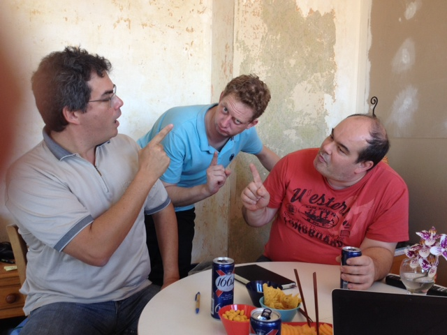

## Electricité - Matos
- (10^2 5m en 3 couleurs)
- Boite derivation grande étanche
- Raccords rapides Wago

- Dominos assortiment
- 2,5 et 1,5 en 3 couleurs (25m)
- Grosse goulotte 10x5
- Serflex

- Anneaux à numéroter
- (Petite goulotte 2x1)
- Vis et chevilles
- Chevilles Crampon
- 4 disjoncteurs 10A
- 5 disjoncteurs 20A
- 1 disjoncteur 32A
- Disjoncteur différentiel 40A et 30mA
- 4 peignes
- 2 interrupteurs en saillie

## Electricité - Premiers secours

Avec la fameuse méthodologie "Dick and Knife", on complète le tableau.

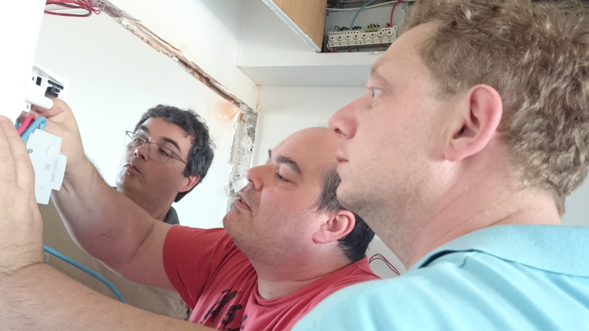

Hop, ça en jette déjà plus:

Les pièges sont nombreux, mais on ne relâche pas la surveillance.

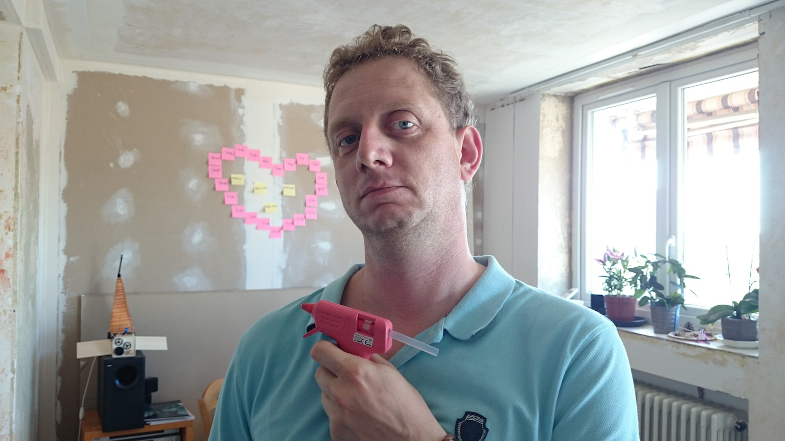

## Electricité - Convalescence

Le triple pontage et l'ablation des appendices sont un franc succès. Fini les trucs qui pendouillent:

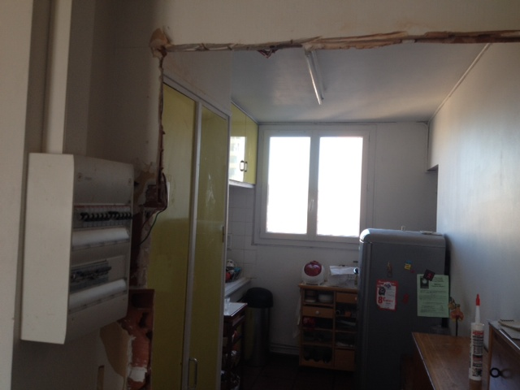

Le tableau s'est enrichi, prêt à accueillir l'installation flambant neuve (ou pas):

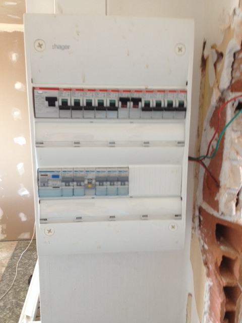

L'interrupteur, posé rustiquement, mais fonctionnel. Exit le néon baveux, place au spot dans la cuisine.

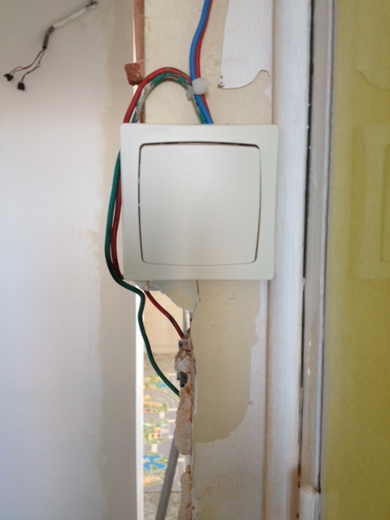

L'interrupteur de l'entrée, dans sa blancrêmeuse splendeur.

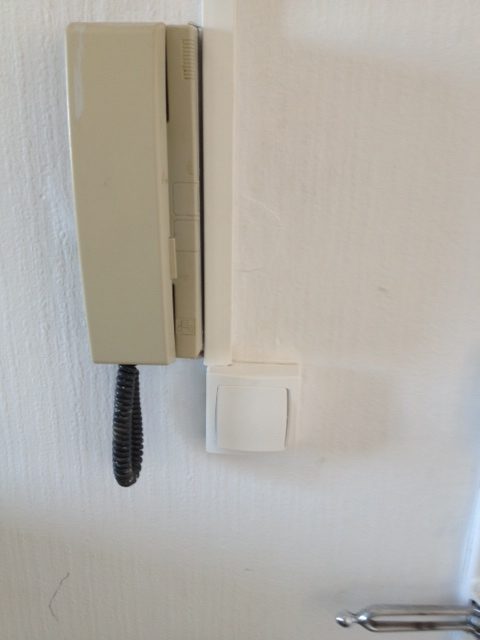

# Day of the tentacle

On y retourne. Cette fois, il en sera terminé de l'electricité spaghetti.

Cette installation sera propre comme un site web dont le layout serait fait à base de &lt;table&gt; comme au bon vieux temps. Non mais.

## Kill it with fire

Première étape, refactoring, a.k.a on vire tout et on réfléchit après.

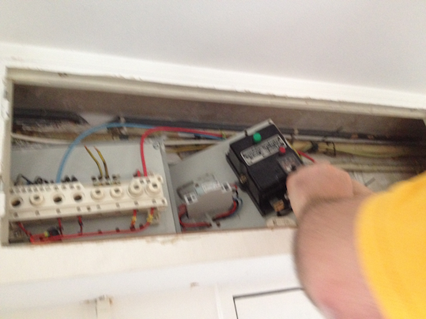

Pas de quartier, pas de pitié. Pas de jus non plus (oups).

## The A-Team

Après cet acte d'une violence inouïe, revenons à des considérations plus paisibles.

Tout d'abord, une telle intervention ça se planifie, ça se prépare. Ici la war room.

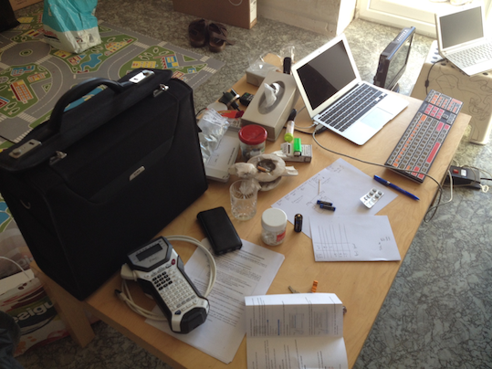

Etiqueteuse, matos de compétiton, notes, calculs savants. Bref, Rocket Science en plus pacifique.

Première étape, on soigne les blessés, voici donc une belle boite de dérivation toute neuve.
Le cablage définitif sera fait plus tard, là on protège juste l'essentiel.

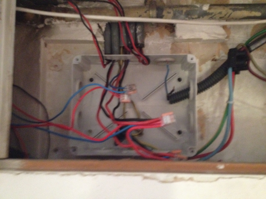

Au tour de René, qui nous rappelle, en bon citoyen helvète,
que si l'horlogerie demande du talent et du travail, la pifométrie requiert du génie.

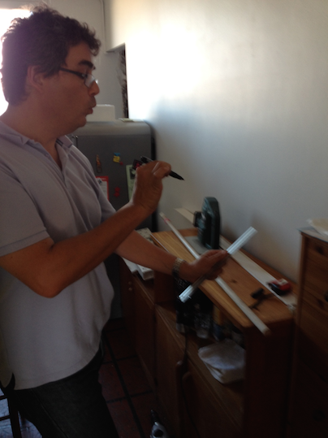

Et que dire du sens de l'improvisation.

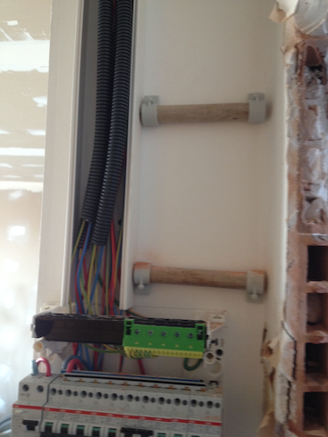

## Trip at the brain

Ah oui, on se demande pourquoi le fuck est cette chose pour?

Réponse: téléportation du disjoncteur, et premiers raccords propres au tableau, étiquetés de manère Yunique.

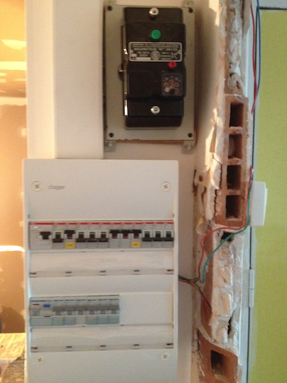

Prochaine étape, mise en application du Trash Driven Development, i.e tout ce qui ne sert à rien, hop poubelle.

# Green IT

Et l'écologie dans tout ça? On y pense, on se creuse la tête, on perce les mystères de la nature,
on se sublime transcendentalement... Mais je m'égare (Matabiau).

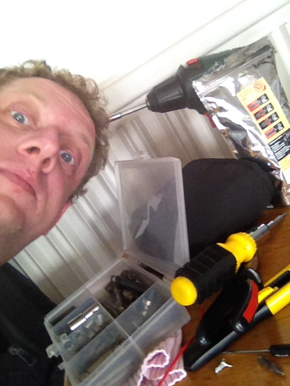

Bref, contre toute attente, il y a une commande Jour/Nuit.
Il est donc de notre devoir d'écocitoyens de réaliser cette économie d'énergie.

Du coup on culpabilisera moins quand on jettera notre prochain Logabax dans la Garonne. C'est bon pour le karma.

## Night and day

La commande Jour/Nuit a donné au Franx un peu de fil à retordre.

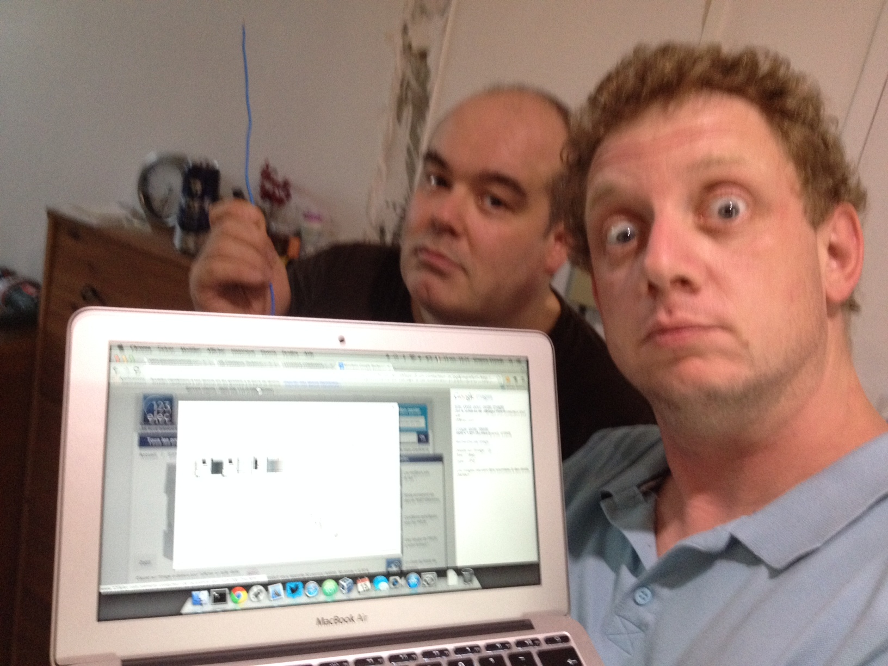

Mais bon, c'est notre journée "hippie", donc on est Green, on est Agile,
et à grands coups de Planning Pokers, on finit par câbler ça correctement.

Ca donne ça au tableau (Kan)bancal, notre Cloud est un Cumulus.

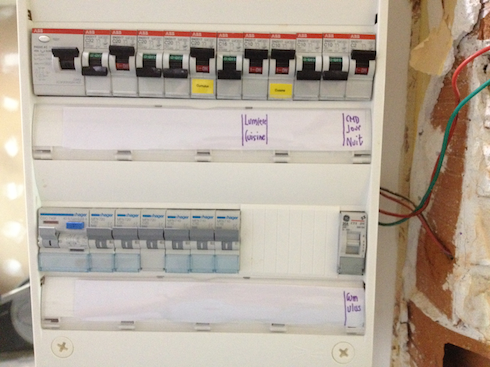

## Helvète Underground

Auréole angélique et maîtrise des spaghetti. C'est beau. Latin.

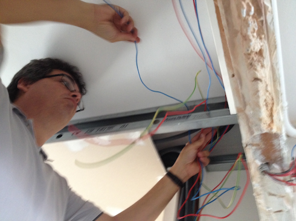

Il paraît que le Flat Design, c'est has-been. On parle de **Material Design**.

Ne serait-ce pas ce que nous sommes précisément en train de faire?
Avec de vrais matériaux?

Croyez-moi (ou pas), le génie c'est parfois dur à porter (sur Garonne).
