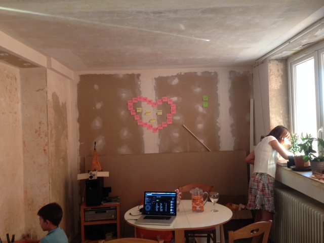
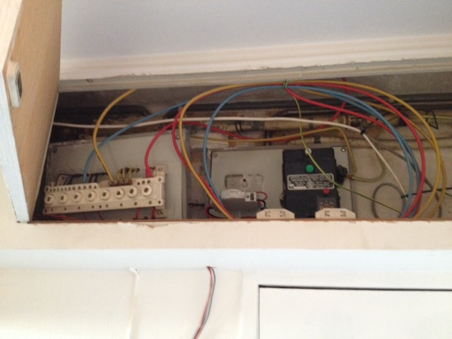
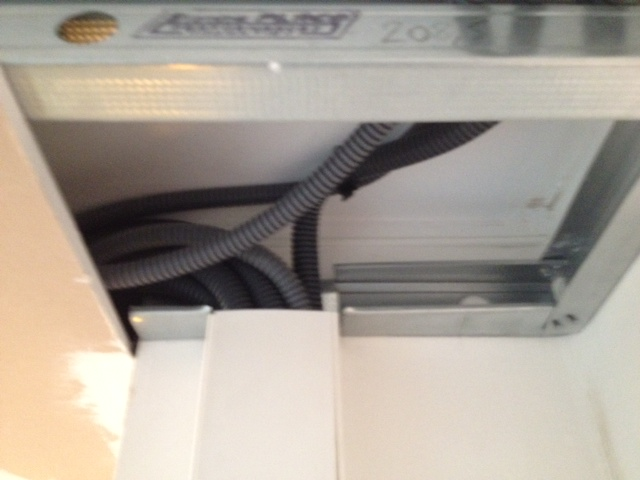



# Etat des lieux

## L'appartement

On est dans du "chantier pas fini permanent", un peu comme l'appart de René :-) mais en pire. Illustration.

## I had a dream

Plans, etc.

# Electricité - Etat des lieux

## La source

Situé au-dessus de la porte d'entrée, le disjoncteur qui fleure bon les années 60. A sa gauche le différentiel général (enfin je crois) qui a l'air d'arriver sur un euh... "trilili", sobrement intitulé "répartition phase".

La plupart de la filasse sortant de ce répartiteur part dans des tuyaux old-school qui constituent l'installation d'origine.

L'un des gros fils rouges part dans une gaine qui alimente un tableau moins old-school.

C'est la gaine complètement à droite, qui descend dans le tableau. Le reste des gaines remonte dans un faux plafond. Le concepteur de l'installation suivante devait être atteint de plaquystérie aïgue. Aïe.

## L'installation d'origine

On est dans le minimaliste, mais au moins ça marche.
