

# Etat des lieux

## L'appartement

On est dans du "chantier pas fini permanent", un peu comme l'appart de René :-) mais en bien pire.

Illustration:

Là c'est le salon, la chambre de Nicolas c'est le même esprit, y'a que la chambre de Yun qui fait plus "finie".

Après il y a la salle de bains, qui est finie, mais moche. Années 60-70, souvenez-vous (ou imaginez), on flirte avec le bon goût sans jamais tomber dedans.

## I had a dream

C'est là que tout est permis, on se lâche, et hop on arrive à ça:

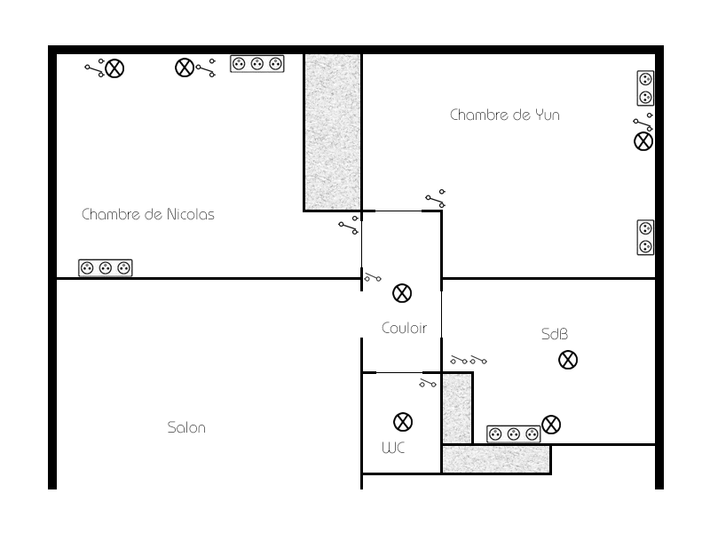

Ca c'est rien, encore, allez hop, la troisième dimension:

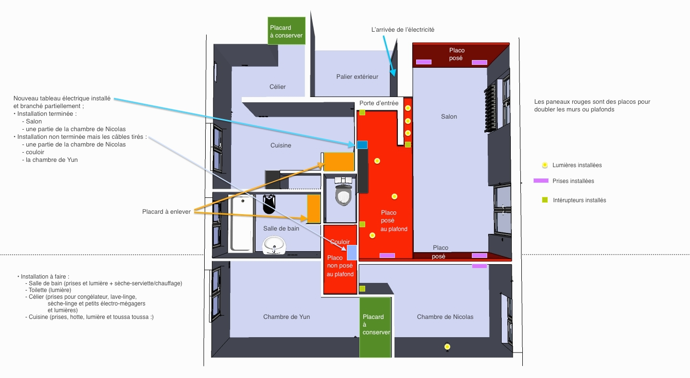

### Chambre de Nicolas

Voilà la chambre de rêve du djeunz:

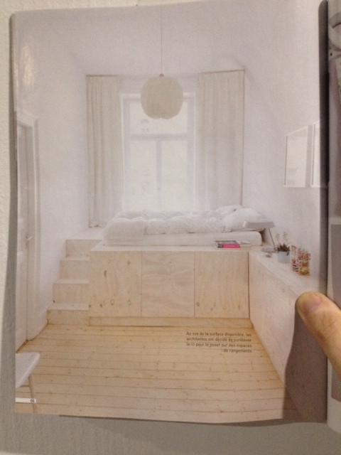

# Electricité - Etat des lieux

## La source

Situé au-dessus de la porte d'entrée, le disjoncteur qui fleure bon le vintage. A sa gauche le différentiel général (enfin je crois) qui a l'air d'arriver sur un... "trilili", sobrement intitulé "répartition phase".

**TODO? Remplacer ce truc?**

La plupart de la filasse sortant de ce répartiteur part dans des tuyaux old-school qui constituent l'installation d'origine.

L'un des gros fils rouges part dans une gaine qui alimente un tableau standard.

**TODO? Tableau plus petit? Ou le compléter et y faire tout descendre?**

C'est la gaine complètement à droite, qui descend dans le tableau. Le reste des gaines remonte dans un faux plafond. Le concepteur de l'installation suivante devait être atteint de plaquystérie aïgue. Aïe.

Le tableau en question:

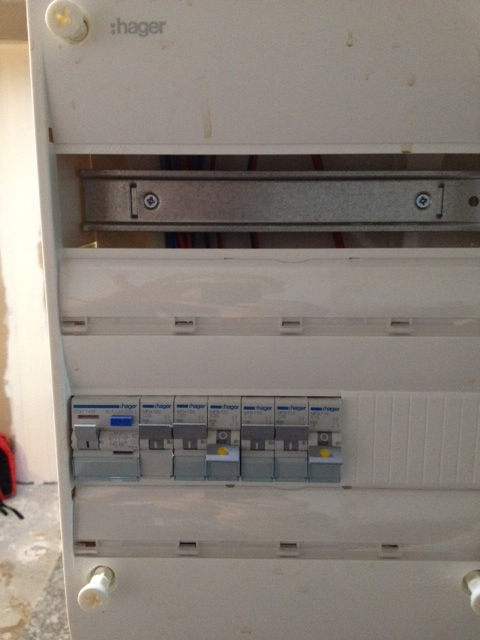

## L'installation d'origine

A l'origine, ça couvrait toutes les pièces (thank you, captain obvious).

Maintenant, ça couvre la cuisine, la salle de bains, la chambre de Yun.

**TODO? Remplacer à minima les prises, interrupteurs, parce que là ça fait peur.**

### Salon

D'après Yun, le plafonnier n'a jamais fonctionné. Diantre. Mais bon, l'électro-plaquiste, faute d'avoir la lumière à tous les étages, a compensé en clapissant le faux plafond de spots. Une véritable poussée d'acné(ons).

### Chambre de Nicolas

L'éclairage au plafond dans la chambre de Nicolas a été désactivé.

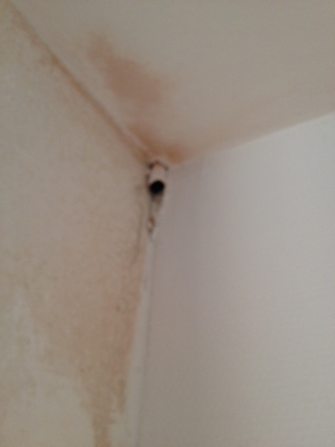

Le plafonnier

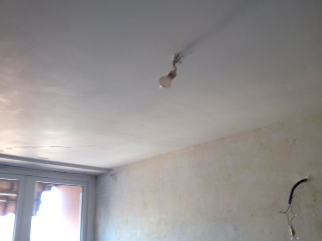

### Cuisine

Il y a eu un charcutage de la cloison d'origine, d'où pendouille lamentablement l'interrupteur de l'éclairage par néon, ainsi qu'un autre interrupteur vintage qui selon Yun devait piloter l'éclairage du couloir.

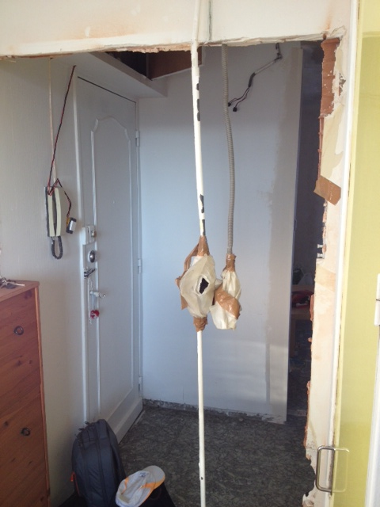

**TODO? Recaler ça contre un mur, mettre un vrai interrupteur, virer ce néon, et peut-être trouver une autre idée que le néon.**

**TODO? Virer l'interrupteur inconnu.**

## La nouvelle installation

Tout commence par un faux-plafond, se poursuit par des plaques superposées sur les cloisons d'origines en brique.

J'ai cherché une blague à faire genre "la groupie du plaquiste", mais j'ai pas trouvé. Ou peut-être que si, tiens.

### Le couloir

A gauche, arrivée du jus depuis le faux plafond. Saignée faite pour y mettre un interrupteur et un plafonnier.

**TODO? Finir le taf.**

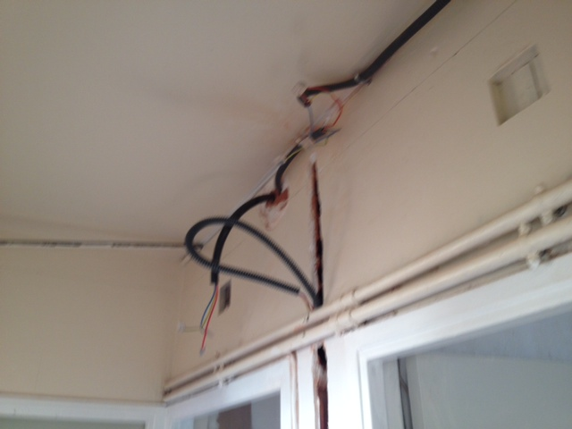

A droite, ça part dans le placard de Yun, et hop ça ressort dans la chambre de Nicolas côté droit.

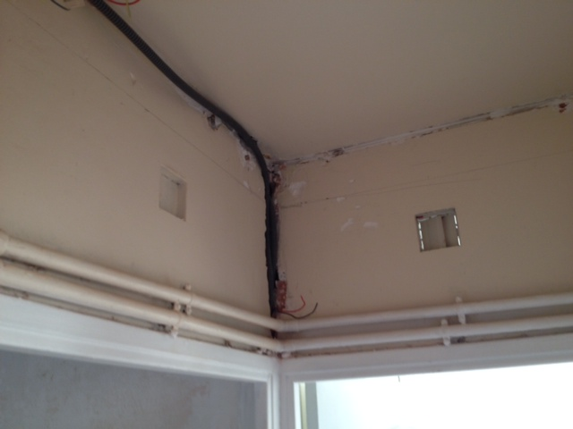

### Chambre de Nicolas

Une saignée a été entamée dans le mur d'origine pour y faire passer 3 prises, mais ça n'a pas été terminé.

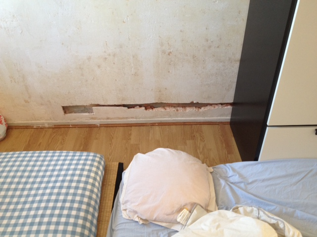

**TODO? Terminer ce qui a été entamé... C'est quoi cette manie de ne rien finir?**

De l'autre côté, des prises ont été posées.

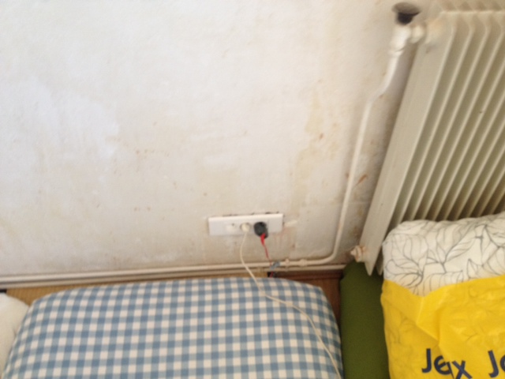

# Demain, c'est déjà hier

Idées en vrac, y'aura de tout, de la plomberie, maçonnerie, peinture, etc.

## Chambre de Nicolas

- **On vire le plafonnier, la lumière sortant du mur côté droit ira bien, on pourra peut-être mettre de l'halogène (éclairage indirect). Plafond blanc.**
- **On vire le radiateur côté gauche. On met un petit convecteur sur le mur, mais plus proche de l'entrée?**
- **Le parquet est bof. Parquet flottant par-dessus? On fait quoi du couloir et du reste?**
- **Le mur de droite est au nord, donc ça caille en hiver. On rajoute une couche d'isolation (placo / laine de verre ?)**
- **Autres murs: ponçage et plâtre?**
- **La fenêtre s'ouvre vers l'extérieur. Donc tringle dans la largeur.**
- **On récupère l'espace occupé par le placard de la chambre de Yun.**

## Chambre de Yun

- **Le placard dégage, on met une cloison a la place.**
- **La porte d'entrée se retrouve en face de celle de Nicolas. On vire donc le radiateur.**
- **On récupère donc la largeur de la porte d'origine pour en faire la profondeur d'un placard mural.**
